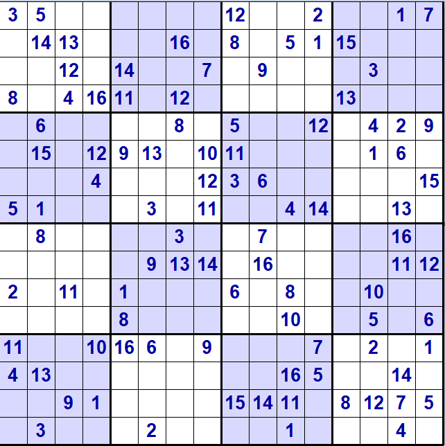
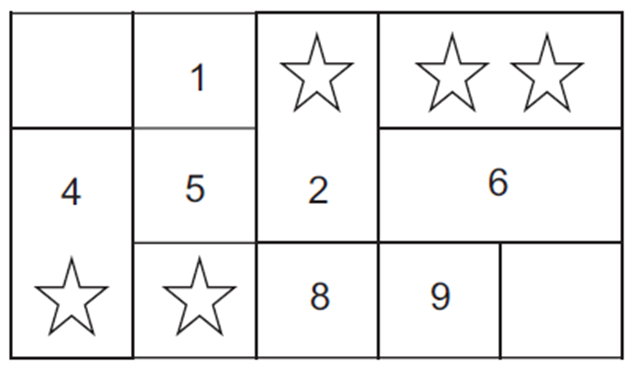

### Лабораторные работы по курсу "Проектирование интеллектуальных систем"
**Косенков Александр**

## ЛР 1 - Решение судоку
**Решатель судоку алгоритмом поиска с запретами (Tabu Search)**\
Исходные данные: 

## ЛР 2 - Решение головоломки "Пять звездочек"
**Решатель головоломки "Пять звездочек" с помощью алгоритма A***\
Исходные данные: 